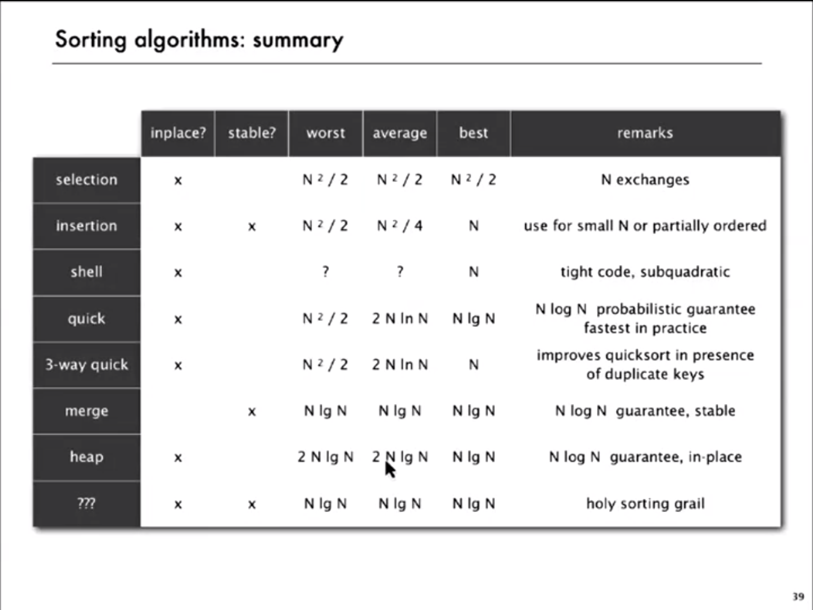

# Unordered Array vs Ordered Array

## unordered array

- insert : o(1), 맨 뒤에 삽입
- del max : o(n), 전체 탐색
- max : o(n), 전체 탐색


## Ordered Array

- insert : o(n), 전체 탐색 이후 중간 삽입
- del max : o(1), 가장 앞에 있는 큐 삭제
- max : o(1), 가장 앞에 있는 큐

> 목표 : insert, del max, max 에 대해 o(log n) 만큼으로 줄여야한다.


## Heap

- 힙은 큰 키(우선 순위)에 자주 액세스하거나 키(우선 순위) 중심으로 정렬된 시퀀스를 활용해야 할 때 유용한 자료구조입니다. 힙은 한 노드(node)가 최대 두 개의 자식노드(child node)를 가지면서, 마지막 레벨을 제외한 모든 레벨에서 노드들이 꽉 채워진 완전이진트리(complete binary tree)를 기본


## Binary Heap

- 이진 트리 개념에 기반
- 부모노드의 키는 자식 노드의 키보다 작지 않다
- 0번째는 배열 비어있다

- 자식 노드가 부모 노드보다 커졌을 경우, 부모노드와 바꿔주기만 하면 된다

> eliminate the violate
- swim 자식 노드에서 부모노드로
- sink 부모 노드에서 자식 노드로 탐색
```java
//k is node
private void swim(int k){
    //parent node is k/2
    while(k>1 && less(k/2, k)){
        exch(k,k/2);
        k = k/2;
    }
}
```
```java
private void sink(int k){
    while(2*k <= N){
        int j = 2*k;
        if(j < N && less(j, j+1)) j++;
        if!(less(k, j)) break;  // 작으면 끝난다는 점에 주의
        exch(k,j);
        k = j;
    }
}
```


# sorting 


